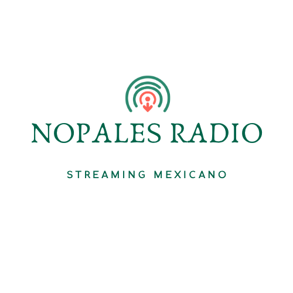

<p align="center">
  
</p>

<h1 align="center">Nopales Radio 📻</h1>

<p align="center">
  🎧 Radio mexicana online — sin anuncios, sin cuentas, sin complicaciones.
</p>

Una app hecha con ❤️ y Expo para escuchar estaciones de radio mexicanas en streaming. Porque el radio no debería necesitar más que un tap.

## 🚀 Features (implementado)

- 📱 Expo SDK ~54 + React Native + TypeScript
- 📡 **50+ estaciones reales** de CDMX (FM/AM), streaming online con expo-audio
- 📴 **Catálogo offline-first** — catálogo local, favoritos y búsqueda funcionan sin internet
- 🔍 **Búsqueda** por nombre, frecuencia, estado y tags
- 🗺️ **Filtros/categorías por género**
- ⭐ **Favoritos** locales
- 🎵 **MiniPlayer** persistente + **pantalla completa** del player
- ⏰ **Sleep timer**
- ▶️ **Background playback** (sigue sonando con la app en segundo plano)
- 📻 **Sintonización por frecuencia** usando streams del catálogo (no chip FM real)
- 🇲🇽 Catálogo inicial enfocado en **México/CDMX**
- 🚫 Sin anuncios · sin cuenta
- 🔓 Open-source (MIT)
- 📦 **APK Android disponible** (distribución manual, no Play Store)

## ℹ️ Aclaraciones importantes

- **No usa el chip FM real del celular.** Todo lo que suena es streaming por internet.
- Para escuchar estaciones **sí necesitas internet o WiFi**. Sin conexión no hay audio.
- Catálogo, favoritos y búsqueda **sí funcionan localmente** sin internet (no así el audio).
- **iOS** funciona en pruebas/desarrollo, pero **no está publicada en App Store**.
- **Android** se distribuye como **APK manual**, no está en Play Store.

## 🧪 FM del teléfono (experimental)

- Experimental, no confundir con streaming (que es el modo principal y estable).
- **iOS**: no disponible.
- **Android**: fase actual solo documenta/prepara el fallback (ver `docs/FM_HARDWARE_RESEARCH.md`).
- Futuro posible: abrir la app FM nativa del fabricante (Samsung, Xiaomi, etc.) si existe en el equipo.
- Nopales **no controla frecuencia FM real** desde su propia UI.

## 📊 Estado de funciones

| Función | Estado | Nota |
|---|---|---|
| Catálogo México (CDMX) | ✅ Implementado | 50+ estaciones reales |
| Catálogo nacional (32 estados) | ⏳ Pendiente | Roadmap |
| Sintonización por frecuencia | ✅ Implementado | Usa streams del catálogo, no chip FM |
| FM hardware real | ❌ No implementado | No viable en Android/iOS estándar (ver docs) |
| Abrir app FM nativa | 🧪 Experimental | Solo documentado/preparado en Android |
| Grabación de streaming | 🔍 En investigación | Bloqueado por temas legales y permisos |
| Widget Android | 🔮 Futuro | No implementado |
| Android Auto / CarPlay | 🔮 Futuro | No implementado |
| iOS | ✅ Funciona (dev) | No publicada en App Store |
| APK Android | ✅ Disponible | Distribución manual, no Play Store |

## 🛠️ Stack

| Capa | Librería |
|------|----------|
| 📱 Framework | Expo SDK ~54 + expo-router |
| 🎨 UI | React Native 0.81, lucide-react-native |
| 🎵 Audio | expo-audio (AAC, MP3, HLS) |
| 💾 Persistencia | AsyncStorage |
| 🌐 Red | @react-native-community/netinfo |

## 📋 Requisitos

- Node.js 20+
- Expo Go en tu celu o simulador

## ⚡ Instalación

```bash
npm install
npm start        # escanea el QR con Expo Go
npm run ios      # simulador iOS
npm run android  # emulador Android
npm run typecheck  # chequea tipos
```

## 📁 Estructura

```
app/                  # páginas (expo-router)
  _layout.tsx         # layout raíz
  index.tsx           # onboarding
  (tabs)/             # tabs: Inicio + Favoritos
  player.tsx          # pantalla full del reproductor
src/
  components/         # StationCard, MiniPlayer
  context/            # RadioPlayerContext, CatalogContext
  hooks/              # useRadioPlayer, useCatalog, useNetworkStatus
  screens/            # HomeScreen
  services/           # NetworkService, CatalogStorageService + FM hardware
  theme/              # constantes de layout
  types.ts            # tipos compartidos
stations_parsed.json  # 50 estaciones reales
docs/                 # investigación técnica (FM hardware, etc.)
```

## 📴 Modo Offline

El catálogo se guarda localmente al primer arranque. Búsqueda y filtros jalan sin internet. El audio de streaming se pausa solo si no hay conexión y reanuda solito cuando vuelves. El streaming en sí **siempre requiere internet**.

## 🗺️ Roadmap

- [ ] 📍 Catálogo nacional (32 estados)
- [ ] 🌎 Expansión LATAM (futuro)
- [ ] 📻 Abrir app FM nativa del fabricante — futuro experimental (Android)
- [ ] 📱 Widget Android
- [ ] 🚗 Android Auto / CarPlay
- [ ] ⏺️ Grabación de streaming — en investigación, no implementado (temas legales y permisos)

## ☕ Apoya el proyecto

Nopales Radio es un proyecto personal open-source hecho con cariño.
Si te sirvió, te gustó o quieres apoyar futuras mejoras, puedes invitarme un café por PayPal:

<p align="center">
  <a href="https://paypal.me/DAlvarado693" target="_blank">
    
  </a>
</p>

> El apoyo es voluntario. El código sigue siendo MIT y libre para usar, modificar y compartir.

## 📦 Build APK Android

```bash
npm install
npm run typecheck
npx eas build:configure
npx eas build -p android --profile preview
```

El APK se comparte manualmente (no está en Google Play).

## 📢 Para compartir (Facebook)

> 🎧 Nopales Radio — app para escuchar estaciones de radio mexicanas (CDMX) en streaming, gratis. Sin anuncios, sin cuenta, open-source. Necesitas internet para escuchar. APK de Android disponible para descarga manual. iOS en pruebas, aún sin publicar en App Store.

## ⚖️ Disclaimer

Esta app es un proyecto personal open-source. Las estaciones, logos y stream URLs pertenecen a sus respectivos dueños. Los URLs pueden cambiar sin aviso. No garantizamos disponibilidad eterna de cada estación.

## 📄 Licencia

MIT — haz lo que quieras con el código, pero invítanos un café si te gusta ☕
